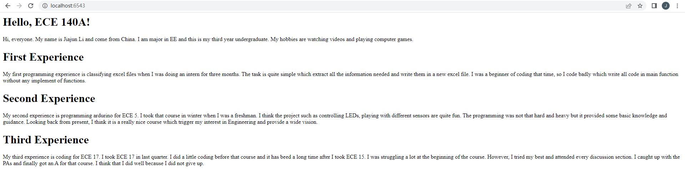

# Tech-Assignment-1
Jiajun Li A16635772
 
The objective of this assignment is to get familiar with python coding and get know how to form a website. 
 
 
In the first challenge, we are making some functions which can solve problems provided. Since I haven't coded in python
before, I went through the whole tutorial before starting this challenge. Furthermore, I took a look on the Internet when I was writing in wrong syntax and debug when my code was getting error. In this challenge, I learnt the data types in python, how to make comments and docstrings, how to operate lists, how to handle strings, how to make a loop, and how to write a function in python.
 
 
In the second challenge, we are told to create a website just like what have been taught in the tutorial section. 
I basically copied down what have been used in tutorial code into this new app.py file and changed text in .html file
to my self introduction. In this challenge, I used .html file to format the website because I may want to add more structures beside text for this website. The response in an HTML file can help we easily adding other features. In the .html file, I have three title and three body paragraphs which make the web more readable. 
 
Here's what my website looks like: 
 
 
In the first tutorial, I have learnt how to use git to upload my files to Github and make version control. It starts with how to install the git and teaches you how to set tup a repository from local and upload to remote. It also provides me some basic command which allows me to give instructions to cmd. Finally, it teaches how to merge confilcts which the version of the repo online is different from the local one. In the second tutorial, I learnt how to install my python and set it up. In this tutorial, it provides you several options to code python. I chose the recommended one, Anaconda, finally. It tells me some basic info about the code editor and its interface. In the third tutorial, I have learnt some basic python syntax which including functions, loops, docstrings and etc. To be specific, I learnt the data types in python, how to make comments and docstrings, how to operate lists, how to handle strings, how to make a loop, and how to write a function in python. In the last tutorial, I learnt how to make a website with python and html file. I have learnt how to create a web with only text by using FastAPI. Then, I learnt how to add more features by using html and jason file. I added a picture of Gesil library on my web at last.
