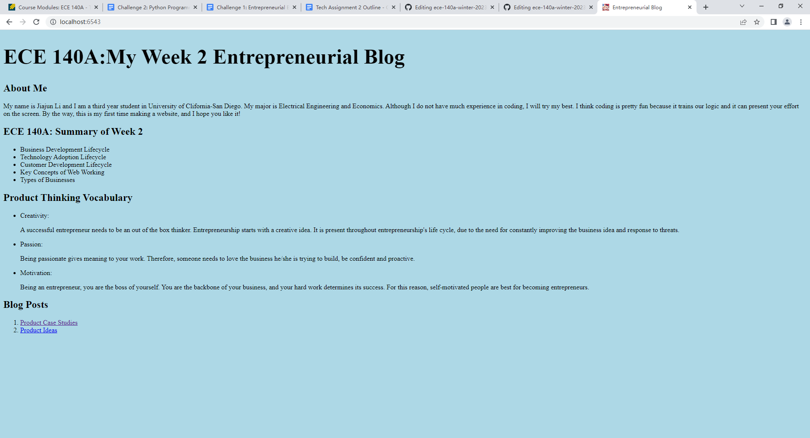
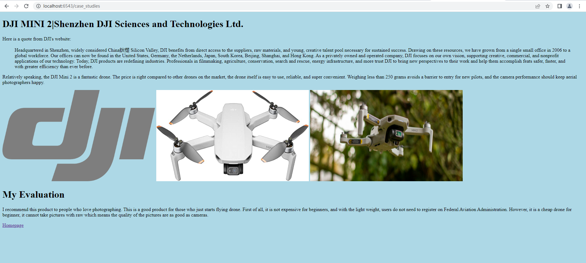
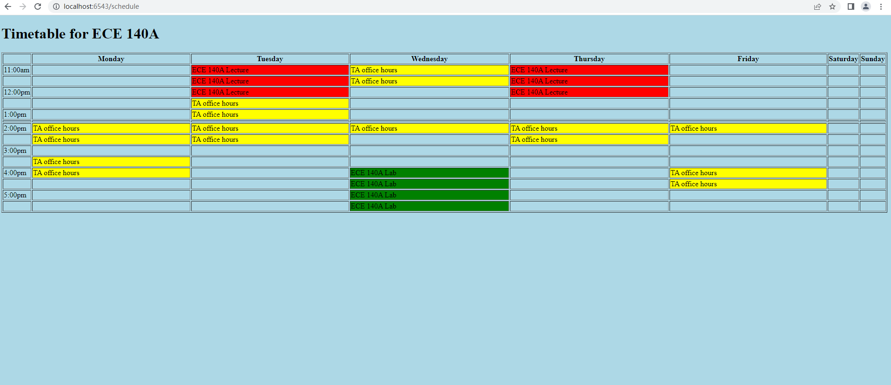

# Tech-Assignment-2
Jiajun Li A16635772

## Tutorial
### Tutorial 1
In the tutorial 1, it introduces some basic knowledge about html file. All html file enclosed with html tag. The name of the web is wrtitten in the head of title tag. We can write comment with <!(comment)> tag. I have also learnt the basic syntax of html file and some tags. I have learnt how to make headings, lists, table, links, and images. An inline element is the element which generate in the same line as the previous tag. However, a block element will start a newline which only contains itself. hr stands for hrizontal rule and br stands for line break. These two tags are used to control the layout of the website. hr can insert a desired line to the webpage, and br can start a newline when it appears.
### Tutorial 2
In the tutorial 2, I learnt how to make a form. Different from other tags we have learnt so far, form tag can take inputs. In the input tag, we can have type, id, name ,and value. Type can control the element being displayed in different ways. id is the identifier for the input element. name is the name that identifies the attribute. value is the initial state of the placeholder. To submit the form, we need a submit type buttom. label element can provide user with an understanding of the input by offering a visual label.
### Tutorial 3
In the tutorial 3, I learnt the difference between HTTP get and HTTP post, and how to apply them with my desire. For HTTP get, I learnt how to create a get route that is accessible to the branch of the main route, just like a file under a folder. In HTTP post, it's quite different in html file as well. The form now needs to have action setting and method setting. The action setting is used to set the location where the form data should be sent to. The method setting is used to specify how the data is sent. In server file, HTTP get and post are different. HTTP post will return data in dictionary form which can be Json file captured. We can also redirect the webpage to other webpages after submitting the form.
### Tutorial 4
In the tutorial 4, I have learnt how to get stock information by using API and Json file. In the tutorial, we created an html file which asks for users which stock do they examine. After taking the stock symbol from users, we access to the Financial Modeling Prep by by combining the format of the url and the API key. We then read the json file down and display on the website for the user. 

## Challenge
### Challenge 1
For the backend code, I used three HTTP get to achieve the displaying of the webpages and redirecting to new webpages. Since there's no form that need to be post, there's no any code to request in server code. To achieve the redirect function, I use hyperlink in html file and that will call response function in server python file which will redirect to to the desired website.

### Challenge 2
